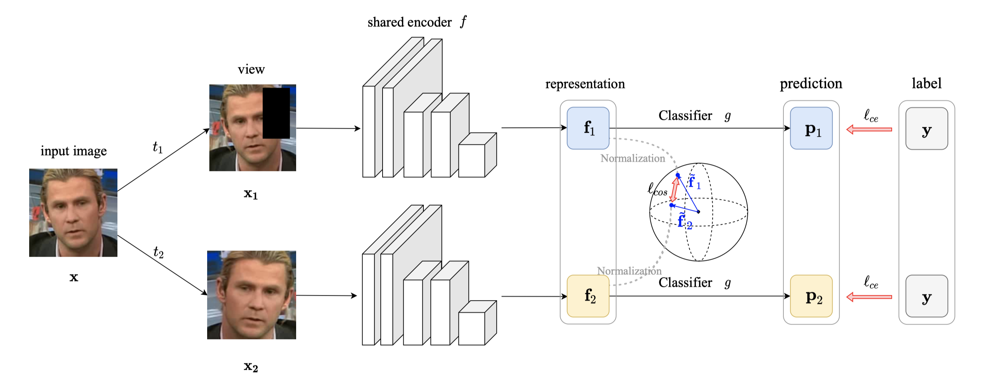
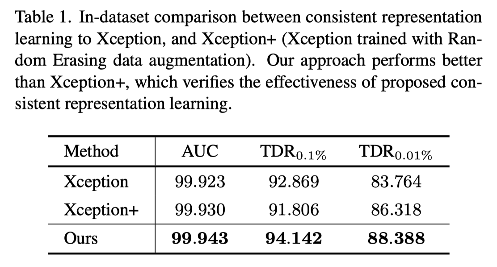
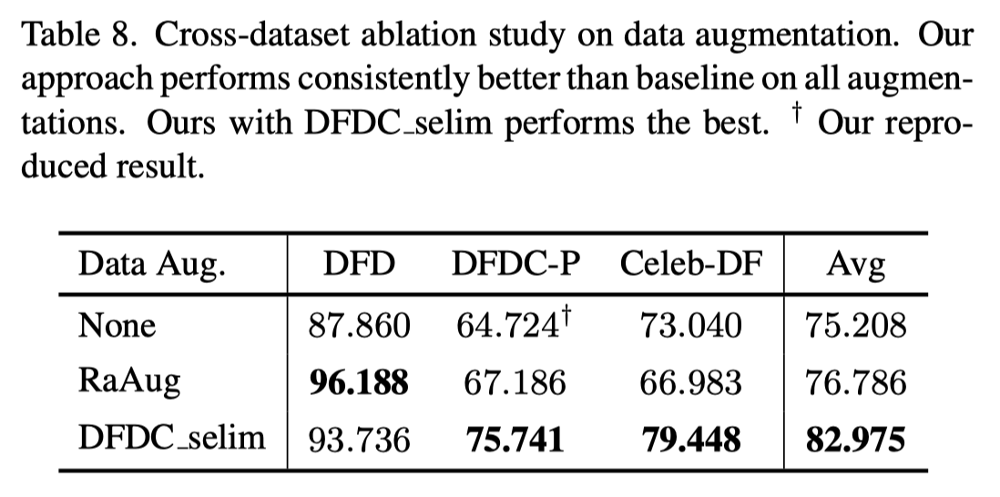

# CORE: COnsistent REpresentation Learning for Face Forgery Detection, CVPRW 22

[paper](https://arxiv.org/abs/2206.02749) 



## Dependencies

```bash
conda create -n CORE python=3.7
conda activate CORE
conda install pytorch torchvision cudatoolkit=11.3 -c pytorch
pip install -r requirements
```

## Data pre-processing

Some errors that crop real faces in manipulated videos occur whether select the biggest or highest detection probability face by MTCNN, especially when there are two characters in a video. We solved the problem by using the provided video mask in FF++.

Please run `python prep_w_mask.py --src-root Your_source_directory --dst-root Your_destination_directory --fake-type Deepfakes[Face2Face, FaceSwap, NeuralTextures, DeepFakeDetection, real]`

## Quickstart

You can reproduced the in-dataset results in Tab.1 using the following three commands:

* Xception: `python main.py --dataset celebdf --aug-name None`
* Xception+: `python main.py --dataset celebdf --aug-name RE`
* Ours: `python main.py --dataset celebdf --aug-name RE --consistency cos --consistency-rate 1.0`



For the cross-dataset results in Tab.8, three commands are as follows:
* None: `python main.py --dataset ff --aug-name None`
* RaAug: `python main.py --dataset ff --aug-name RaAug --consistency cos --consistency-rate 100.0`
* DFDC_selim: `python main.py --dataset ff --aug-name DFDC_selim --consistency cos --consistency-rate 100.0`



## Thanks

1. We used RFM data augmentations, [https://github.com/crywang/RFM](https://github.com/crywang/RFM)
2. We used DFDC_selim data augmentations, [https://github.com/selimsef/dfdc_deepfake_challenge](https://github.com/selimsef/dfdc_deepfake_challenge)
3. We modify xception model to output feature, [https://github.com/tstandley/Xception-PyTorch](https://github.com/tstandley/Xception-PyTorch)


## Citation

```
@InProceedings{Ni_2022_CVPR,
    author    = {Ni, Yunsheng and Meng, Depu and Yu, Changqian and Quan, Chengbin and Ren, Dongchun and Zhao, Youjian},
    title     = {CORE: COnsistent REpresentation Learning for Face Forgery Detection},
    booktitle = {Proceedings of the IEEE/CVF Conference on Computer Vision and Pattern Recognition (CVPR) Workshops},
    month     = {June},
    year      = {2022},
    pages     = {12-21}
}
```
